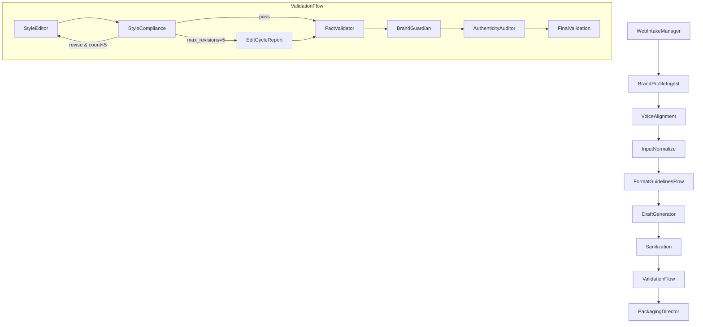

# Design Doc: Text-Only, Multi-Platform Content System

> Please DO NOT remove "Notes for AI".

## Requirements

> Notes for AI: Keep it simple. Convert abstract asks into concrete user stories.

### User stories

- As a marketer, I want text-only content for Reddit, TikTok, Instagram, Twitter, Blog, Email, YouTube, Facebook, LinkedIn, Bluesky that fits each platform.
- As a brand manager, I want outputs aligned to brand values from a free-text brand brief and extracted tags.
- As a creator, I want a web form intake, live progress, and copy-ready artifacts per platform.
- As a user, I want each artifact to be easy to copy without extra formatting steps.

### Scope and constraints

- Text generation only. No publishing. No scraping.
- Outputs are copy-ready blocks per platform. No packaging requirements beyond simple Markdown export when requested.
- Inputs:
  - Brand brief (multi-line text) → extract brand keywords "tags".
  - Topic. Platform checkboxes.
  - Reddit: user pastes subreddit name or URL, rules, description or bio.
  - TikTok and YouTube: topic or video URL with optional transcript.
  - Email: user pastes thread or received email for reply mode.
- Strict style policy:
  - Ban em dash.
  - Ban rhetorical contrasts and related devices listed in "7 deadly sins.md".
  - Remove "AI fingerprints" during sanitization.
- Streaming: show milestone updates only. Full drafts appear when complete.
- Presets stored locally in JSON when saved by user.

### Success criteria

- Each output obeys platform guidelines and style policy.
- Validation loop runs up to 5 iterations, then final validation runs.
- Artifacts are frictionless to copy per platform. No extra cleanup needed.
- Progress visible from 0 to 100 with stage names.

---

## Flow Design

> Notes for AI:
> 1. Consider the design patterns of agent, map-reduce, rag, and workflow. Apply them if they fit.
> 2. Present a concise, high-level description of the workflow.

### Applicable Design Pattern

1. **Workflow**: Linear pipeline with routing and validation loops.
2. **Batch**: Process multiple selected platforms in parallel using BatchNode.
3. **Map-Reduce**: Scaffold sections (map) then assemble (reduce) for each platform.
4. **Agent**: Router node dynamically selects platform-specific formatting logic.

### Flow high-level Design

1. **WebIntakeManager**: Collect brand brief, extract tags, get platforms, topic, and optional per-platform extras (Reddit rules, video transcripts, email threads).
2. **BrandProfileIngest**: Map brief to controlled persona and tone axes.
3. **VoiceAlignment**: Normalize tone. Assert forbidden patterns are not present.
4. **InputNormalize**: Canonicalize Reddit name or title; normalize video inputs; parse email thread.
5. **FormatGuidelinesFlow (Batch)** via **FormatGuidelinesRouter**: Generate per-platform Guidelines objects.
6. **DraftGenerator**: Calculate section budgets by platform, scaffold sections, then assemble final draft.
7. **Sanitization**: Remove AI fingerprints and style violations.
8. **ValidationFlow**:
   - **StyleEditor** + **StyleCompliance** loop (≤ 5 iterations)
   - **FactValidator** → **BrandGuardian** → **AuthenticityAuditor** → **FinalValidation**
9. **PackagingDirector**: Collate per-platform copy blocks and optionally export simple Markdown bundle. Stream completion milestone.



---

## Platforms and Guideline Notes

> Notes for AI: Build a unified Guidelines schema per platform: limits, structure, tone, hashtags, links, markdown, CTA, extra notes.

- **Reddit**: Use pasted rules and description. Require TL;DR if long. Markdown blocks allowed. Flair notes optional.
- **TikTok**: Caption length, hook first line, 0–5 hashtags, optional emojis, time-based prompts from video topic or transcript.
- **Instagram**: Caption with line breaks, 8–20 hashtags, CTA variant, include 2–3 short prompts for image generation.
- **Twitter**: Single or threaded logic by character count threshold. 0–3 hashtags.
- **Blog**: H2 or H3 outline, internal links placeholders, summary and CTA.
- **Email**: Subject length target. Single CTA. Modes: first message, notification, newsletter, reply-from-thread.
- **YouTube**: 1–3 paragraph description and tags. Pull topic or provided transcript.
- **Facebook**: 1–2 paragraph post plus optional first comment text.
- **LinkedIn**: Short paragraphs, whitespace, hashtags at end.
- **Bluesky**: Micro-post format similar to Twitter.

---

## Style Policy: "7 Deadly Sins" Enforcement

> Notes for AI: Enforce bans during sanitization and compliance.

Hard bans:

1. Em dash (—)
2. Rhetorical contrast patterns like "not just X; Y"
3. Antithesis
4. Paradiastole
5. Reframing contrast
6. Chiasmus-like contrast
7. Tagline framing or positioning statements that elevate by contrast

Detection lives in `utils/check_style_violations.py`. Editing uses `utils/rewrite_with_constraints.py`.

---

## Utility Functions

> Notes for AI:
> 1. Understand the utility function definition thoroughly by reviewing the doc.
> 2. Include only the necessary utility functions, based on nodes in the flow.

1. **Brand Tag Extractor** (`utils/brand_tag_extractor.py`)
   - *Input*: brand_brief (str)
   - *Output*: list of brand keywords/tags
   - *Used by*: WebIntakeManager to extract brand tags from free-text brief

2. **Brand Profile Mapper** (`utils/brand_profile_mapper.py`)
   - *Input*: brand_brief (str), brand_tags (list)
   - *Output*: persona_voice dict (persona, tone axes)
   - *Used by*: BrandProfileIngest to map brief to controlled persona and tone

3. **Input Normalizer** (`utils/input_normalize.py`)
   - *Input*: platform-specific raw inputs (subreddit name/URL, video data, email thread)
   - *Output*: normalized dict per platform
   - *Used by*: InputNormalize node

4. **Format Platform Guidelines** (`utils/format_platform.py`)
   - *Input*: platform name, persona_voice, intent, nuance
   - *Output*: Guidelines object (limits, structure, tone, hashtags, links, markdown, CTA)
   - *Used by*: FormatGuidelinesRouter to build per-platform Guidelines

5. **Calculate Section Budgets** (`utils/calculate_section_budgets.py`)
   - *Input*: platform Guidelines, total character limit
   - *Output*: dict of section budgets (hook, body, CTA, etc.)
   - *Used by*: DraftGenerator for section scaffolding

6. **Enforce Hashtag Placements** (`utils/enforce_hashtag_placements.py`)
   - *Input*: platform name, draft text, hashtag list
   - *Output*: draft with hashtags placed per platform rules
   - *Used by*: DraftGenerator and Sanitization

7. **Check Style Violations** (`utils/check_style_violations.py`)
   - *Input*: text (str), style_policy (str)
   - *Output*: list of violations (hard and soft)
   - *Used by*: StyleCompliance node to detect "7 deadly sins" and hard bans

8. **Rewrite With Constraints** (`utils/rewrite_with_constraints.py`)
   - *Input*: text (str), violations (list), constraints (dict)
   - *Output*: rewritten text (str)
   - *Used by*: StyleEditor node to fix violations without introducing new bans

9. **Report Builder** (`utils/report_builder.py`)
   - *Input*: revision history, final violations
   - *Output*: EditCycleReport (str or dict)
   - *Used by*: ValidationFlow to summarize failures at max revisions

10. **Progress Streamer** (`utils/progress.py`)
    - *Input*: stage name, percent complete
    - *Output*: milestone event to UI stream
    - *Used by*: All major nodes to emit progress updates

11. **Call LLM** (`utils/call_llm.py`)
    - *Input*: prompt (str)
    - *Output*: response (str)
    - *Used by*: Most nodes for LLM-based generation and editing tasks

---

## Node Design

### Shared Store

> Notes for AI: Try to minimize data redundancy

The shared store structure is organized as follows:

```python
shared = {
    "config": {
        "style_policy": "strict",  # "strict" or "permissive"
        "loop_max": 5,             # max StyleCompliance iterations
        "platforms_selected": []   # list of platform names
    },
    "intake": {
        "brand_brief": "",         # multi-line text from user
        "brand_tags": [],          # extracted keywords
        "topic": "",               # main topic/subject
        "platforms": [],           # list of selected platform names
        "reddit": {
            "name_or_url": None,
            "rules_text": None,
            "description_text": None
        },
        "video": {
            "tiktok": {"url": None, "transcript": None},
            "youtube": {"url": None, "transcript": None}
        },
        "email": {
            "mode": "first|notification|newsletter|reply",
            "thread_text": None
        }
    },
    "persona_voice": {},           # persona and tone axes from brand brief
    "platform_guidelines": {},     # dict keyed by platform name -> Guidelines object
    "content_pieces": {},          # dict keyed by platform name -> draft text
    "style_compliance": {},        # dict keyed by platform name -> violations list
    "workflow_state": {
        "stage": "",               # current stage name
        "completed": [],           # list of completed stages
        "revision_count": 0,       # current revision iteration
        "manual_review": False     # flag for manual review needed
    },
    "final_package": {
        "approved": {},            # dict keyed by platform name -> final copy
        "edit_cycle_report": None  # report if max revisions reached
    }
}
```

### Node Steps

> Notes for AI: Carefully decide whether to use Batch/Async Node/Flow.

1. **WebIntakeManager**
   - *Purpose*: Collect user inputs, extract brand tags, save/load presets
   - *Type*: Regular Node
   - *Steps*:
     - *prep*: None (initial node)
     - *exec*: Call `brand_tag_extractor` to extract tags from brand brief
     - *post*: Write intake data and brand_tags to shared["intake"] and shared["config"]

2. **BrandProfileIngest**
   - *Purpose*: Map brand brief to persona and tone
   - *Type*: Regular Node
   - *Steps*:
     - *prep*: Read brand_brief and brand_tags from shared["intake"]
     - *exec*: Call `brand_profile_mapper` to generate persona_voice
     - *post*: Write persona_voice to shared["persona_voice"]

3. **VoiceAlignment**
   - *Purpose*: Normalize tone and assert forbidden patterns are not present
   - *Type*: Regular Node
   - *Steps*:
     - *prep*: Read persona_voice from shared
     - *exec*: Call LLM to validate and refine tone consistency
     - *post*: Update persona_voice in shared

4. **InputNormalize**
   - *Purpose*: Canonicalize platform-specific inputs (subreddit, video, email)
   - *Type*: Regular Node
   - *Steps*:
     - *prep*: Read platform-specific raw inputs from shared["intake"]
     - *exec*: Call `input_normalize` to parse and canonicalize
     - *post*: Write normalized inputs back to shared["intake"]

5. **FormatGuidelinesRouter**
   - *Purpose*: Dispatch per-platform guideline generation
   - *Type*: Batch Node (processes each selected platform)
   - *Steps*:
     - *prep*: Read selected platforms from shared["config"]["platforms_selected"]
     - *exec*: For each platform, call `format_platform` to build Guidelines object
     - *post*: Write Guidelines to shared["platform_guidelines"] keyed by platform

6. **DraftGenerator**
   - *Purpose*: Scaffold sections and assemble final draft per platform
   - *Type*: Batch Node (processes each platform)
   - *Steps*:
     - *prep*: Read platform_guidelines and persona_voice from shared
     - *exec*: Call `calculate_section_budgets`, then LLM to generate sections, then assemble
     - *post*: Write draft to shared["content_pieces"] keyed by platform

7. **Sanitization**
   - *Purpose*: Remove AI fingerprints and style violations
   - *Type*: Batch Node (processes each platform draft)
   - *Steps*:
     - *prep*: Read draft from shared["content_pieces"]
     - *exec*: Call `check_style_violations` then `rewrite_with_constraints`
     - *post*: Update draft in shared["content_pieces"]

8. **StyleEditor**
   - *Purpose*: Rewrite draft to fix style violations
   - *Type*: Regular Node (called within loop)
   - *Steps*:
     - *prep*: Read draft and violations from shared["style_compliance"]
     - *exec*: Call `rewrite_with_constraints` to fix violations
     - *post*: Update draft in shared["content_pieces"]

9. **StyleCompliance**
   - *Purpose*: Detect style violations and loop if needed
   - *Type*: Regular Node with branching logic
   - *Steps*:
     - *prep*: Read draft from shared["content_pieces"]
     - *exec*: Call `check_style_violations` to detect hard and soft issues
     - *post*: If violations exist and revision_count < 5, return "revise" action; else return "pass" or "max_revisions"

10. **EditCycleReport**
    - *Purpose*: Generate report when max revisions reached
    - *Type*: Regular Node
    - *Steps*:
      - *prep*: Read revision history and final violations
      - *exec*: Call `report_builder` to summarize
      - *post*: Write report to shared["final_package"]["edit_cycle_report"]

11. **FactValidator**
    - *Purpose*: Flag claims that need sources
    - *Type*: Regular Node
    - *Steps*:
      - *prep*: Read drafts from shared["content_pieces"]
      - *exec*: Call LLM to identify unsupported claims
      - *post*: Annotate or flag claims in shared

12. **BrandGuardian**
    - *Purpose*: Score brand alignment and provide micro-suggestions
    - *Type*: Regular Node
    - *Steps*:
      - *prep*: Read drafts and persona_voice
      - *exec*: Call LLM to score alignment and suggest improvements
      - *post*: Update drafts or store suggestions in shared

13. **AuthenticityAuditor**
    - *Purpose*: Check for hype and over-claims
    - *Type*: Regular Node
    - *Steps*:
      - *prep*: Read drafts
      - *exec*: Call LLM to detect excessive claims
      - *post*: Flag or update drafts in shared

14. **FinalValidation**
    - *Purpose*: Gate before packaging
    - *Type*: Regular Node
    - *Steps*:
      - *prep*: Read all validation outcomes
      - *exec*: Aggregate pass/fail status
      - *post*: Set manual_review flag if needed, otherwise approve

15. **PackagingDirector**
    - *Purpose*: Collate per-platform copy blocks and export Markdown
    - *Type*: Regular Node
    - *Steps*:
      - *prep*: Read approved drafts from shared["content_pieces"]
      - *exec*: Format copy blocks and optionally generate Markdown bundle
      - *post*: Write final package to shared["final_package"]["approved"]. Emit completion milestone via `progress_streamer`.

---

## 60/30/10 Task Map

> Notes for AI: Keep the manual gate.

**Automate ~60%**

- Tag extraction, guideline generation, scaffolding, first drafts, sanitization pass, compliance checks, simple export.

**Assist ~30%**

- Voice tuning suggestions, fact triage list, brand alignment suggestions, hashtag set variants.

**Manual ~10%**

- Final edits, subreddit rule compliance check, legal review if needed, acceptance sign-off.

---

## MVP Spec

> Notes for AI: Smallest viable, then iterate.

### Scope v1.0

- Platforms: Reddit, Instagram, Twitter, Blog, Email, LinkedIn.
- Inputs: brand brief, topic, subreddit fields, email thread, optional IG image prompt output.
- Outputs: per-platform copy blocks. Optional Markdown bundle.

### Non-goals v1.0

- Publishing. External scraping. Auto video transcript fetch. Any ROI analytics.

### Acceptance tests

1. Each selected platform yields a copy block that passes StyleCompliance with zero hard bans and ≤ 2 soft warnings.
2. Validation loop never exceeds 5 cycles.
3. Reddit outputs include TL;DR when long and respect pasted rules.
4. Email reply mode keeps quoted context and single CTA.
5. Instagram includes 8–20 hashtags and 2–3 image prompts.
6. Progress UI shows ordered stages and percent updates.
7. Each copy block can be copied in one action without cleanup.

### Rollback

- If StyleCompliance fails at 5, attach EditCycleReport, mark manual_review, and ship latest drafts.
- If a platform node errors, skip that node, flag in package, and continue others.

---

## SOP for Human Steps

### Before run

- Paste subreddit rules and description if Reddit selected.
- Paste email thread if reply mode.
- For TikTok or YouTube later versions, paste transcript if available.

### After run

- Review EditCycleReport when present.
- Approve or request one targeted rewrite.
- Copy blocks or export Markdown on demand.

### Edge cases

- Claims without sources → redact or add citation.
- Topics with sensitive content → route to legal or compliance.
- Brand bans list conflicts → override only with written approval.

---

## Instrumentation

- **Metrics**: runtime per run, failure rate, revision_count mean, violations histogram, user edits after delivery.
- **Logs**: stage durations and validation outcomes.

---

## File Outputs

- Per-platform `.md` files when requested.
- On-screen copy blocks with single-click copy.
